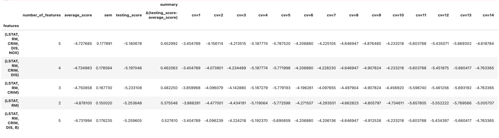
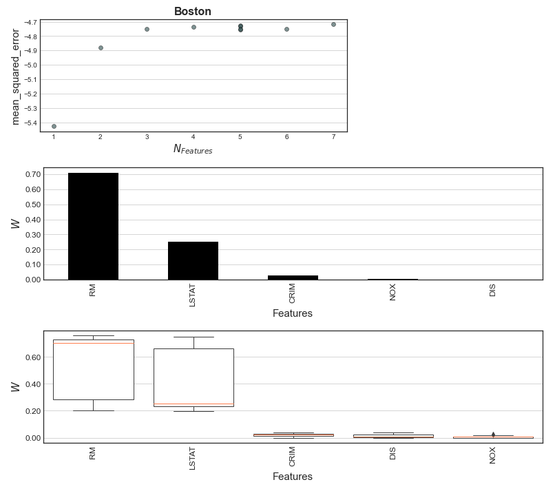
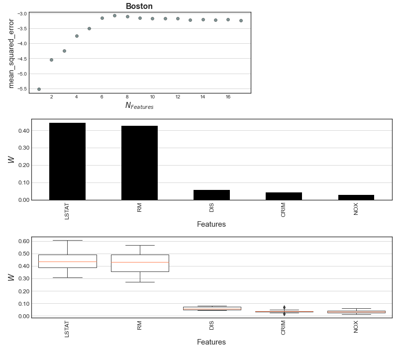

```
 _______        _______ _____  ______ _    _  _____  __   __ _______ __   _ _______ _______
 |       |      |_____|   |   |_____/  \  /  |     |   \_/   |_____| | \  | |       |______
 |_____  |_____ |     | __|__ |    \_   \/   |_____|    |    |     | |  \_| |_____  |______
```
#### Description

Reimplementation for `Clairvoyance` from [Espinoza & Dupont et al. 2021](https://journals.plos.org/ploscompbiol/article?id=10.1371/journal.pcbi.1008857).  The updated version includes regression support, support for all linear/tree-based models, and improved visualizations.  `Clairvoyance` is currently in active development.   


#### Details:
`import clairvoyance as cy`

`__version__ = "2022.1.3"`

#### Installation

```
# Stable:
pip install clairvoyance_feature_selection
conda install -c jolespin clairvoyance

# Developmental:
pip install git+https://github.com/jolespin/clairvoyance
```

#### Citation

Espinoza JL, Dupont CL, O’Rourke A, Beyhan S, Morales P, Spoering A, et al. (2021) Predicting antimicrobial mechanism-of-action from transcriptomes: A generalizable explainable artificial intelligence approach. PLoS Comput Biol 17(3): e1008857. https://doi.org/10.1371/journal.pcbi.1008857

#### Development
*Clairvoyance* is current in active development and undergoing a complete reimplementation from the ground up from the original publication.  The following includes a list of new features: 

*  Supports any linear or tree-based `Scikit-Learn` compatible model
*  Supports any `Scikit-Learn` compatible performance metric
*  Supports regression (in addition to classification as in original implementation)
*  Properly implements transformations for compositional data (e.g., CLR and closure) based on the query features for each iteration
*  Added option to remove zero weighted features and redundant feature sets
*  Added asymmetric mode in addition to the symmetric mode from the original implementation
*  Added informative publication-ready plots
*  Outputs multiple combinations of hyperparameters and scores for each feature combination
*  Option to use validation sets or alternative models for recursive feature inclusion


#### Usage


##### Feature selection based on classification tasks
Here's a basic classifcation using a `LogisticRegression` model and a grid search for different `C` and `penalty` parameters. We add 996 noise variables within the range of values as the original Iris features. After that we normalize them so their scale is standardized.  In this case, we are optimizing for `accuracy`.  We are using a `LogisticRegression` where we don't really have to worry about features with zero weight in the end so we are going to set `    remove_zero_weighted_features=False`.  This will allow us to plot a nice RCI curve with error.

```python
import clairvoyance as cy
import numpy as np
import pandas as pd
from sklearn.datasets import load_iris
from sklearn.linear_model import LogisticRegression

# Load iris dataset
X, y = load_iris(return_X_y=True, as_frame=True)
X.columns = X.columns.map(lambda j: j.split(" (cm")[0].replace(" ","_"))

# Relabel targets
target_names = load_iris().target_names
y = y.map(lambda i: target_names[i])

# Add 996 noise features (total = 1000 features) in the same range of values as the original features
number_of_noise_features = 996
vmin = X.values.ravel().min()
vmax = X.values.ravel().max()
X_noise = pd.DataFrame(
    data=np.random.RandomState(0).randint(low=int(vmin*10), high=int(vmax*10), size=(150, number_of_noise_features))/10,
    columns=map(lambda j:"noise_{}".format(j+1), range(number_of_noise_features)),
)

X_iris_with_noise = pd.concat([X, X_noise], axis=1)
X_normalized = X_iris_with_noise - X_iris_with_noise.mean(axis=0).values
X_normalized = X_normalized/X_normalized.std(axis=0).values

# Specify model algorithm and parameter grid
estimator=LogisticRegression(max_iter=1000, solver="liblinear", multi_class="ovr")
param_grid={
    "C":[1e-10] + (np.arange(1,11)/10).tolist(),
    "penalty":["l1", "l2"],
}

# Instantiate model
clf = cy.ClairvoyanceClassification(
    n_jobs=-1, 
    scorer="accuracy", 
    n_draws=10, 
    estimator=estimator, 
    param_grid=param_grid, 
    verbose=1,
    remove_zero_weighted_features=False,

)
clf.fit(X_normalized, y)#, sort_hyperparameters_by=["C", "penalty"], ascending=[True, False])
history = clf.recursive_feature_inclusion(early_stopping=10)
history.head()

```


```python
clf.plot_scores(title="Iris", xtick_rotation=90)
clf.plot_weights()
clf.plot_weights(weight_type="cross_validation")
```


There are still a few noise variables, though with much lower weight, suggesting our classifier is modeling noise.  We can add an additional penalty where a change in score must exceed a threshold to add a new feature during the recursive feature inclusion algorithm.  We are keeping `    remove_zero_weighted_features=False` for this example.

```python
history = clf.recursive_feature_inclusion(early_stopping=10, minimum_improvement_in_score=0.05)
clf.plot_scores(title="Iris", xtick_rotation=90)
clf.plot_weights()
clf.plot_weights(weight_type="cross_validation")
```


Now let's do a binary classification but optimize `fbeta` score instead of `accuracy`.  Instead of a fixed penalty, we are going to use a custom penalty that scales with the number of features included. 

```python
from sklearn.metrics import fbeta_score

# Let's do a binary classification
y_notsetosa = y.map(lambda x: {True:"not_setosa", False:x}[x != "setosa"]) 

# Let's also use a FBeta scorer
scorer = make_scorer(fbeta_score, average="binary", beta=0.5, pos_label="setosa")

# Instantiate model
clf_binary = cy.ClairvoyanceClassification(
    n_jobs=-1, 
    scorer="accuracy", 
    n_draws=10, 
    estimator=estimator, 
    param_grid=param_grid, 
    remove_zero_weighted_features=False,
    verbose=1,
)

# Let's also prefer lower C values and l1 over l2 (i.e., stronger regularization and sparsity)
clf_binary.fit(X_normalized, y, sort_hyperparameters_by=["C", "penalty"], ascending=[True, True]) 

# Instead of adding a fixed penalty for adding new features, let's add a function that scales with the number of features
history = clf_binary.recursive_feature_inclusion(early_stopping=10, additional_feature_penalty=lambda n: 1e-3*n**2)
history.head()
```


```python
clf_binary.plot_scores(title="Iris (Binary)", xtick_rotation=90)
clf_binary.plot_weights()
clf_binary.plot_weights(weight_type="cross_validation")
```


##### Feature selection based on regression tasks
Here's a basic regression using a `DecisionTreeRegressor` model and a grid search for different `min_samples_leaf` and `min_samples_split` parameters. We add 87 noise variables and normalize all of the features so their scale is standardized.  In this case, we are optimizing for `neg_root_mean_squared_error`.  We are using a validation set of ~16% of the data during our recursive feature inclusion. For decision trees, we have the issue of getting zero-weighted features which are uninformative and misleading for RCI.  To get around this, we implement a recursive feature removal that only keeps non-zero weighted features.  We can turn this on via `remove_zero_weighted_features=True`.  This also ensures that there are no redundant feature sets (not an issue when `remove_zero_weighted_features=False` because they are recursively added).  

Note: When we use `remove_zero_weighted_features=True`, we get a scatter plot instead of a line plot with error because there are multiple feature sets (each with their own performance distribution on the CV set) that may have the same number of features.

```python
from sklearn.datasets import load_boston
from sklearn.tree import DecisionTreeRegressor
from sklearn.model_selection import train_test_split

# Load Boston data
boston = load_boston()
X = pd.DataFrame(boston.data, columns=boston.feature_names)
y = pd.Series(boston.target)

number_of_noise_features = 100 - X.shape[1]
X_noise = pd.DataFrame(np.random.RandomState(0).normal(size=(X.shape[0], number_of_noise_features)),  columns=map(lambda j: f"noise_{j}", range(number_of_noise_features)))
X_boston_with_noise = pd.concat([X, X_noise], axis=1)
X_normalized = X_boston_with_noise - X_boston_with_noise.mean(axis=0).values
X_normalized = X_normalized/X_normalized.std(axis=0).values

# Let's fit the model but leave a held out validation set
X_training, X_validation, y_training, y_validation = train_test_split(X_normalized, y, random_state=0, test_size=0.1618)

# Get parameters
estimator = DecisionTreeRegressor(random_state=0)
param_grid = {"min_samples_leaf":[1,2,3,5,8],"min_samples_split":{ 0.1618, 0.382, 0.5, 0.618}}

# Fit model
reg = cy.ClairvoyanceRegression(
	name="Boston", 
	n_jobs=-1, 
	n_draws=10, 
	estimator=estimator, 
	param_grid=param_grid, 
	verbose=1,
	remove_zero_weighted_features=True,
)
reg.fit(X_training, y_training)
history = reg.recursive_feature_inclusion(early_stopping=10, X=X_validation, y=y_validation)
history.head()
```


```python
reg.plot_scores(title="Boston", xtick_rotation=90)
reg.plot_weights()
reg.plot_weights(weight_type="cross_validation")
```


There's some noise features that make it through using `DecisionTreeRegressor` models.  Instead of adding a penalty, let's use the weights fitted with a `DecisionTreeRegressor` but use an ensemble `RandomForestRegressor` for the actual feature inclusion algorithm. 

```python
from sklearn.ensemble import RandomForestRegressor
history = reg.recursive_feature_inclusion(early_stopping=10, estimator=RandomForestRegressor(random_state=0), X=X_validation, y=y_validation)
reg.plot_scores(title="Boston", xtick_rotation=90)
reg.plot_weights()
reg.plot_weights(weight_type="cross_validation")
```


That's much better...

##### Recursive feature selection based on classification tasks
Here we are running `Clairvoyance` recursively identifying several feature sets that work with different hyperparameters to get a range of feature sets to select from in the end.  We will iterate through all of the hyperparamater configurations, recursively feed in the data using different percentiles of the weights, and use different score thresholds from the random draws.  The recursive usage is similar to the legacy implementation used in [Espinoza & Dupont et al. 2021](https://journals.plos.org/ploscompbiol/article?id=10.1371/journal.pcbi.1008857) (which is still provided as an executable).

```python
# Get the iris data again
X_normalized = X_iris_with_noise - X_iris_with_noise.mean(axis=0).values
X_normalized = X_normalized/X_normalized.std(axis=0).values
target_names = load_iris().target_names
y = pd.Series(load_iris().target)
y = y.map(lambda i: target_names[i])

# Specify model algorithm and parameter grid
estimator=LogisticRegression(max_iter=1000, solver="liblinear", multi_class="ovr")
param_grid={
    "C":[1e-10] + (np.arange(1,11)/10).tolist(),
    "penalty":["l1", "l2"],
}

# Instantiate model
rci = cy.ClairvoyanceRecursive(
    n_jobs=-1, 
    scorer="accuracy", 
    n_draws=10, 
    estimator=estimator, 
    param_grid=param_grid, 
    percentiles=[0.0, 0.1, 0.2, 0.3, 0.4, 0.5, 0.6, 0.7, 0.8, 0.9, 0.925, 0.95, 0.975, 0.99],
    minimum_scores=[-np.inf, 0.382, 0.5],
    verbose=0,
    remove_zero_weighted_features=False,
)
rci.fit(X_normalized, y, sort_hyperparameters_by=["C", "penalty"], ascending=[True, True])
rci.plot_recursive_feature_selection()

```

We observe a nice separate around 10 features, so let's use that as a maximum. 


```python
# Plot the features with a maximum of 10
rci.plot_recursive_feature_selection(max_features=10)

# Filter out all the results that have more than 10 features
rci.results_.query("number_of_features <= 10").sort_values("score", ascending=False).head()
```


